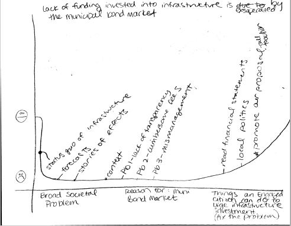

# Part I
# Summary
The lack of funding invested in U.S. infrastructure is exasperated by the lack of transparency, cumbersome fees, and mismanagement of municipal infrastructure bonds. I will explain the status quo of infrastructure, shed light on the problems, and promote/foreshadow my Systems teams proposed solution (to be published in May 2019). 
# Story Arc

As you can see, my viewers will start with neutral feelings, immediately see staggering (and sad) numbers and be presented with harsh forecasts. Then, we will dig deeper into the problems and causes of our infrastructure failures. Finally, their mood may swing back up to neutral when I present a glimmer of hope (our project). 
# Story Structure
Setup: Infrastructure is falling apart, the forecasts are bleak, and this is hurting citizens. 
Conflict: Infrastructure bonds are opaque, include cumbersome fees, and are riddled by mismanagement. 
Resolution: A team of Heinz College system is proposing federal legislation to change the way bonds are administered. 

# The Data 
I will use media reports, images, and stories to show the status quo of infrastructure. One compelling and recent media report comes from Business Insider. 
https://www.businessinsider.com/asce-gives-us-infrastructure-a-d-2017-3#aviation-d-1
I will use the American Society of Civil Engineers data to show current spending versus needed spending on infrastructure, which is accessible here.
https://www.infrastructurereportcard.org/the-impact/economic-impact/ 

**To show the lack of transparency:**
I will explain current law around reporting requirements for muni bonds, or find a video that can. (Please note, this may be cut if I cannot find a simple way to describe it). 

**To show the cumbersome fees:**
I will *attempt* to create an infographic and show how money flows. I will try to find documentation of average fees for underwriters, lawyers, and accountants, but may have to cite estimates from Professor Robert Strauss, who is a financial expert and is also our Systems Advisor. 

**To show mismanagement:**
I will show this data and explain why “refunding” should never need to happen but often does. I will also try to look for a graphic to explain the refunding process. Finally, I will highlight the lack of use of sinking funds as a reason (and one that we hope to solve in our proposal). 
https://www.irs.gov/statistics/soi-tax-stats-tax-exempt-bond-statistics 

To explain why this proposal is necessary in a future of uncertainty, I will show this video. 
https://www.youtube.com/watch?v=oV1t6smUcIw

Finally, I will preview our proposal, which includes **8 steps.** I will try to do this using an infographic.  

# Method and Medium 
For the stories and images to show the state of the infrastructure problem, I will look for photos or panoramic to build a 360 view on this site: https://scene.knightlab.com/ . 
In addition, I will browse media and podcasts to see if there are any powerful voices talking about this problem, who I might be able to embed a quote from using http://soundcite.knightlab.com/ .
I will make my graphs in **Datawrapper,** and my infographic in **Infogram.** 
To put the entire presentation together, I will use **Shorthand.**
# Shorthand Tips to Incorporate
# Planning Tips
1) Break the story down (above), 2) Start beyond a front cover (with maximize impact), 3) Never ending engagement (call to action), 4) Deadlines (build in time for feedback), 5) Flow & Focus (to ensure it’s easy to follow), 6) Performance (make sure my media is viewable on devices), 7) Use media & interactivity with meaning (must bring something to the story), 8) Using Word (check formatting or save as plain text), 
# Design Tips
1) Start simple (clean with headers), 2) Mobile based use, 3) Headers & pull-quotes to add signals (chunked), 4) Style consistency, 5) Watch the eyes of people/animals (don’t cover)
# Publishing Tips
1) Confident with hosting process (ask questions to TA/Professor if needed), 2) Analytics (data to track)
# Promotion Tips 
1) Thinking beyond the headline (build up an audience, clue or question that entices reader to step into the story, quote cards, moving gifs) 

# Part II 
Shorthand Preview: https://preview.shorthand.com/QBW1ihFshlkR306i
# a. Target Audience
The target audience of my proposal is Congress. I want them to understand the urgency needed in their response to the state of our infrastructure. I also want them to realize that the financing structures are one of the key problems causing our infrastructure challenges. 

# b. Finding Representative Individuals
Unfortunately, I cannot interview Congressional members. However, I have interviewed 2 members of my systems team (on this project), my systems advisor, my brother (accounting major in college), and my best friend (PhD candidate in Psychology). I have 3 people with a lot of knowledge on the topic and 2 with little to no knowledge of the topic. 

# c. Interview Script
My goal today is to get feedback on an infographic and chart that my team is designing (I did not want to say me to my family/friend to avoid them being overly nice). I am talking to see what makes sense and what is unclear. I would like you to be as honest as possible, as my team and I are hoping to end with the most-polished and clear final product that we possibly can.  
Infographic: 
1.	Do you know what this is representing? 
2.	Can you describe the relationships between different parties? 
3.	Is any connection hard to interpret? 

Graphs: 
1.	Do you know what this is representing? 
2.	Can you think of anything to add or change to make this more clear? 

# d. Interview Findings 

# Infogram: 
•	Broad bullet points of the plan
•	Be more concise in the “to ensure” statements. 
•	Add an example to the bonds useful life proposal. Possibly move the useful life bullet to the first point because it explains the bonds. 
•	Define safe public securities on the last bullet points. 

# Project Infrastructure Gap
•	Add billions of dollars
Shorthand text: Severe Gaps don’t match “what does this mean people?”  delete most severe gaps sentence? Or add a connecting sentence (other concerns).

# Bond Issuance flow charts: 
•	Need to add key on what the lines mean
•	Inv = investor
•	Switch order of “Mayor” and “public authority” 
•	Possibly based this off of an example
•	Add assumptions to graphic

# Bonds by type: 
•	Add a clearer definition of each type of bond 
•	Add a clearer x-axis label – include the months at the bottom.
•	Add a clearer y-axis key or percentage?
•	The description does not match – should average multiple years instead of just 2018

# Municipal Bond Issues by Type
•	Need to add (in millions), add year of data. 
•	Need to add dollar signs, possibly break into 2 charts because amount and number are not on the same scale – have a double bar chart (with new money issues in one color, and refunding issues in another color) or have number and amount as different colors to show clearer grouping. 
•	Key at the bottom to represent number and amount. 
•	Key at the top is pointless right now (does not tell the user much) because it does not apply to both. 
•	Add source for the data. 
•	Systems team member said to show amount only

# Proposal for Qualified Municipal Infrastructure Bonds
•	Summarize “the solution” in 1 sentence before this infogram
•	Add in “(QMIB)” in the title
•	Make sure to give a brief definition of sinking funds and avoid unnecessary jargon
•	Not enough explanation of generational equity earlier on in the proposal 
•	Change “maturity” to “financing period” 

# e. Implemented Changes
Due to time constraints (and an ability to get meetings with my systems team and professor), I did not finish these interviews until Monday evening. However, given the user feedback, I plan to implement the outlined changes by Wednesday. 

